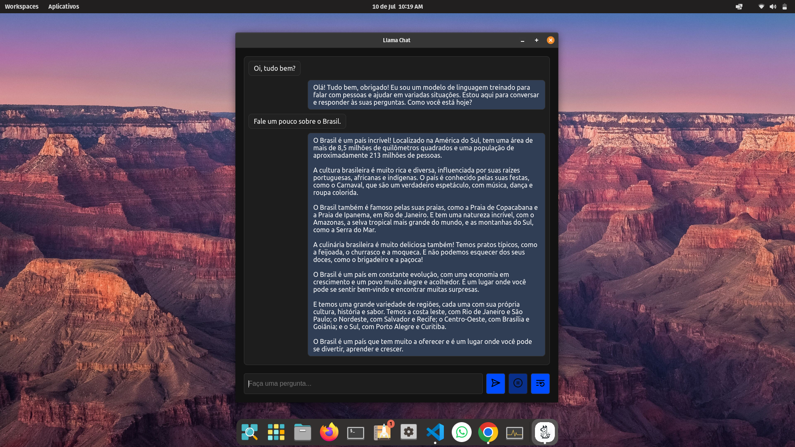

# Llama Chat

Um aplicativo de desktop simples para interagir com grandes modelos de linguagem (LLMs) hospedados localmente usando a API Ollama.

<p align="center">
  
</p>

## Demonstração

https://github.com/user-attachments/assets/3bcabfa2-1053-4b45-a8f7-77f6fbde4ef4

<p align="center">
  
</p>

## Como rodar?

Siga as instruções para a release do seu sistema: [Releases](https://github.com/jefersonapps/llama-chat/releases)

## Pré-requisitos para desenvolvimento

- **Node.js e npm:** Certifique-se de ter o Node.js e o npm instalados em seu sistema.
- **Ollama:** Instale e configure o Ollama em sua máquina local. Consulte o repositório para obter mais informações: [https://github.com/ollama/ollama](https://github.com/ollama/ollama)

## Uso em desenvolvimento

1. Clone este repositório:

   ```bash
   git clone https://github.com/jefersonapps/llama-chat.git
   ```

2. Navegue até o diretório do projeto:

   ```bash
   cd llama-chat
   ```

3. Instale as dependências:

   ```bash
   npm install
   ```

## Iniciando ambiente de desenvolvimento

1. Após configurar o Ollama em sua máquina local, siga as instruções do reposiório para rodar o modelo llama3:

   ```bash
   ollama run llama3
   ```

2. Inicie o aplicativo Llama Chat executando o seguinte comando na pasta do repositório clonado:

   ```bash
   npm start
   ```

3. O aplicativo será aberto em uma nova janela.
4. Digite sua pergunta ou prompt no campo de entrada e pressione Enter ou clique no botão "Enviar".
5. O aplicativo enviará sua solicitação para o servidor Ollama e exibirá a resposta no chat.

## Recursos

- Interface de chat simples e intuitiva.
- Suporte para streaming de respostas da API Ollama.
- Botões para cancelar a geração de resposta e limpar o histórico do chat.
- Atalho de teclado (CommandOrControl+L) para mostrar/ocultar a janela do aplicativo.

## Notas

- O aplicativo assume que o servidor Ollama está em execução em `http://localhost:11434` (porta padrão). Se você configurou o Ollama em uma porta diferente, ajuste a URL no código-fonte do aplicativo.
- O modelo de linguagem padrão usado é `llama3`. Você pode alterar isso no código-fonte do aplicativo para usar outros modelos disponíveis no Ollama.
- A execução do modelo requer um alto uso de memória ram e processamento, se o modelo estiver demorando muito, considere liberar a memória ram do sistema.

## Contribuição

Contribuições são bem-vindas! Sinta-se à vontade para abrir problemas ou enviar solicitações pull.

## Licença

Este projeto está licenciado sob a Licença MIT.
